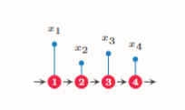
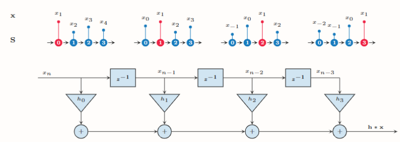
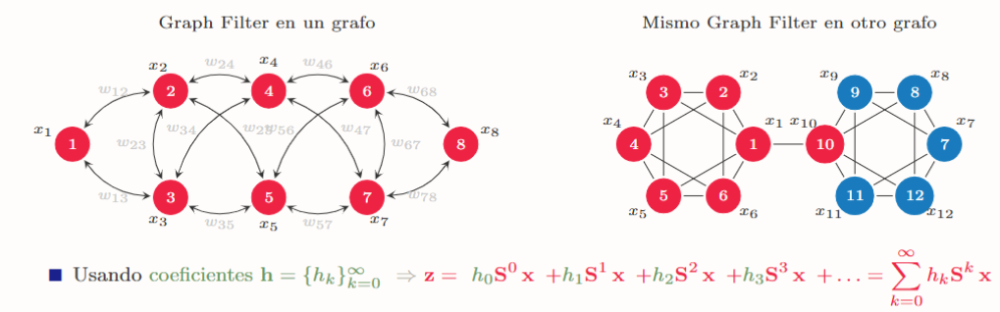

Graph Neural Networks (GNNs)

Intro
    Algunos ejemplos

Motivación
EMpirical Risk Minimization (ERM)

    Tenemos: COnj d enetranmiento; clase de funciones (aqui es donde entra GNN); funcion de pérdida (mide la bondad de ajuste)

    Vamos a querer hayar dentro de la flia de funciones la que minimiza la función de pérdida.

    Que es un dato en este caso?    -> Grafo
                                    -> Señal en los nodos
                                    -> Atributos en las aristas

    REPRESENTANDO DATOS EN GRAFOS
        Tomo una decision: le pongo un orden a los nodos y por ende tambien un orden a la señal (es arbitrario)

        Queremos que la funcion NO DEPENDA DEL ORDEN y que sea aplicable a grafos de distinto tamaño (quiero ser capaz de operar)

CONVOLUCIONES EN GRAFOS

    CONVOLUTIONAL NEURAL NETWORKS (CNNs)

    (Diapo 11)

    Graph Convolucion =>  GSP => Graph Filtering (??)

    CNN: toma una matriz y genera otra usando la convolución

    Señales en tiempo discreto => Cercanía contiene informacion

    

    NECESITO HACER UN BUEN ORDEN PARA QUE LA SUCESION SEA SUAVE 
    Como es una serie de tiempo, se que el grafo que representa es una linea 

    Fijamos el orden de los nodos => Permutaciones => queda definida la matriz S genérica (Graph Shift Operator)

    GRAPH CONVOLUTION: Combinacion lineal de versiones desplazadas de la señal (el grafo es el mismo, solamente muevo el grafo hacia la derecha, se empuja de a 1. eso se logra al multiplicar por un operador)

    

    K lo elijo yo (exapande la mascara)

    De INformacion Local a Global
        Puedo operar el mismo filtro en distintos grafos

        

        En principio la flia de funciones cumple con lo que quería
    

    HASTA ACA VIMOS FILTROS. SIGUE EL APRENDIZAJE

GNN: Construccion

    Señal -> Filtro -> Nueva señal

    Aprendiendo usando un Graph Perceptron

    La salida da un paramámetro H(tensor) (vamos a querer elegir la cantidad de h's)

    Ventaja GNN: 