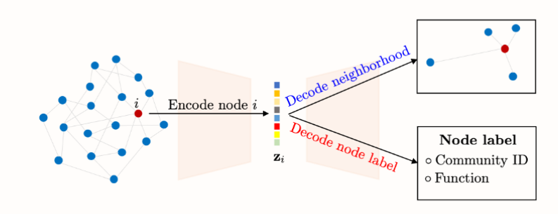

GRAPH REPRESNTATION LEARNING (GRL)

Embeddings de grafos (Adjacency spectral embedding)

    Elegimos una dimension (d) para escalabilidad 
    Capturan la informacion estructural del grafo, y al pasarlo a la dimension podemos usar métodos geométricos de análisis. (ej: clustering)

    Embedding inductivos:
    Embedding transductivo:

    NO SUPERVISADO: PRESERVA estructura del grafo: comprensión; clustering; predicción de enlaces
    SUPERVISADO: clasificacion de nodos; clasificacion de grafos

    

    La reconstrucción es aproximada

    Graph Encoder Decoder Model (GraphEDM)

    